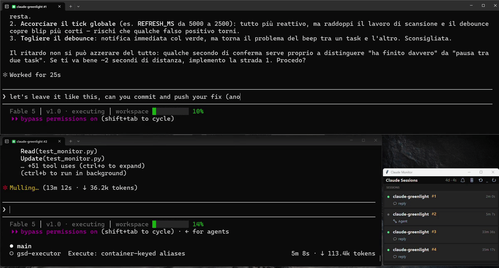
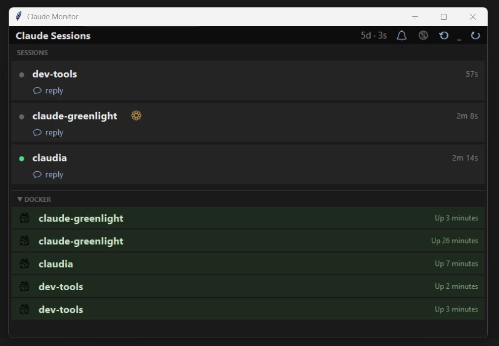
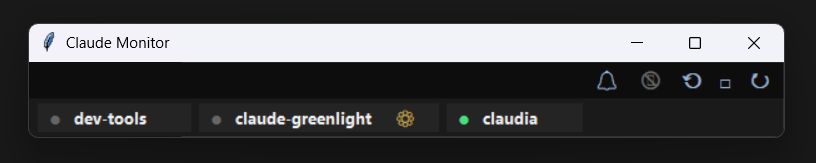

# Claude Greenlight 🟢

> **On Windows, with Claude Code running inside containers, no monitor sees your sessions' live state.**
> Claude Greenlight does — and tells you the moment Claude gives you the green light.

Per-session attention monitor for [Claude Code](https://claude.com/claude-code) — built for **Windows hosts running sessions inside WSL2 / Docker containers**.



## Screenshots





## The problem

You run several Claude Code sessions in parallel — each in its own Docker container — and switch between them while they work. Existing monitors watch local processes or rely on locally-registered hooks, so from Windows they can't see what happens inside the containers: session history at best, no live state, no "your turn" signal.

Claude Greenlight reads the session transcripts under `~/.claude` on the **host** — the same directory your containers bind-mount — so it sees every session live, wherever it runs.

## What it does

- **Always-on-top overlay** (standard or compact) listing every active session with a project label and its live state: working, ready for you, or waiting for input
- **Notifies you** — toast, sound, taskbar flash — when a session that has been working for a while becomes ready
- **A session waiting on you mid-turn never shows as "working"** — permission prompts and `AskUserQuestion` modals surface the instant they appear, through the same hooks that drive state detection
- **Optional Telegram push** to your phone, independent of local notifications
- **Per-session aliases**, persisted across restarts
- **Zero dependencies** — Python 3.10+ standard library only (tkinter)

## Setup

**Requirements:** Windows 10/11 with Python 3.10+ (tkinter included in the standard installer).

**1. Get the code**

```
git clone https://github.com/3000tech/claude-greenlight.git
cd claude-greenlight
```

**2. Start the monitor**

```
monitor.bat          (background, via pythonw)
monitor-debug.bat    (visible console, for troubleshooting)
```

**3. Make container sessions visible**

Bind-mount the host's `.claude` directory into each container at the container user's home:

```
docker run -v "%USERPROFILE%\.claude:/home/dev/.claude" ...
```

The container user must be able to write there (match its UID to the mount, e.g. UID 1000 on WSL2 9p mounts). Sessions running directly on Windows or in WSL with `~/.claude` on the Windows filesystem are visible with no extra setup.

**4. Install the hooks (required)**

```
bash hooks/install.sh
```

Run it wherever Claude Code actually runs — inside the container image / entrypoint, or in WSL. Requires `jq`. This is how the monitor knows a session's state: installing writes one small per-session state file under `~/.claude/monitor-state/` on Claude Code's own lifecycle events (turn start, tool use, turn end, permission prompts), plus a working lock that covers the gaps where no event fires. A session running without the hooks stays visible — the monitor still reads its transcript as a fallback — but its state is less accurate than a hooked session's.

### Headless Linux container / devcontainer (development)

`scripts/headless-linux.sh` launches the monitor on a Linux box with no display and no tkinter. It needs no root — it stages tcl/tk into a user cache (override with `GREENLIGHT_TK_CACHE`) and starts a virtual `Xvfb` display. Requires an `Xvfb` binary and python3.11 on x86_64. Arguments are forwarded to `monitor.py`. This is primarily for development and smoke-testing — the supported end-user target is still Windows, per the section above.

```
bash scripts/headless-linux.sh
```

**Start at login** (optional): press `Win+R`, run `shell:startup`, and drop a shortcut to `monitor.bat` in the folder that opens.

## Configuration

`%USERPROFILE%\.claude-monitor-config.json` (created on first run, editable from the UI):

| Key | Meaning |
|-----|---------|
| `mode` | `standard` or `compact` overlay |
| `local` | master switch for toast + sound + taskbar flash |
| `telegram` | enable/disable Telegram push |
| `aliases` | per-container display names, keyed by container identity (managed from the UI) — survive `/clear`, `/resume` and CLI restarts |

**Telegram** (optional): create a `.env` file next to `monitor.py`:

```
TELEGRAM_BOT_TOKEN=...
TELEGRAM_CHAT_ID=...
```

**Launcher integration** (optional): set `CLAUDE_LAUNCHER_SH` to a shell script containing a `PROJECTS=( "label|..." ... )` array to control project naming and display order.

## How it compares

Tools like cctop, Sessionly, or the various claude-code-monitors work well when sessions run on the same OS as the monitor. On a Windows host with sessions inside WSL2/Docker they show history at best — not live state (verified with Sessionly 2.0). Tray-light tools like claude-semaphore aggregate everything into a single light and don't notify; Claude Greenlight is per-session and pages you.

## Development

```
python3 -m unittest test_monitor.py
python3 -m unittest test_state_writer.py
python3 -m unittest test_event_logger.py
```

Design notes live in [`.planning/NOTES.md`](.planning/NOTES.md). The hook verification matrix and the per-version recertification runbook live in [`docs/TEST-MATRIX.md`](docs/TEST-MATRIX.md) and [`docs/RECERTIFICATION.md`](docs/RECERTIFICATION.md).

---

Unofficial community tool — not affiliated with Anthropic. [MIT](LICENSE).
